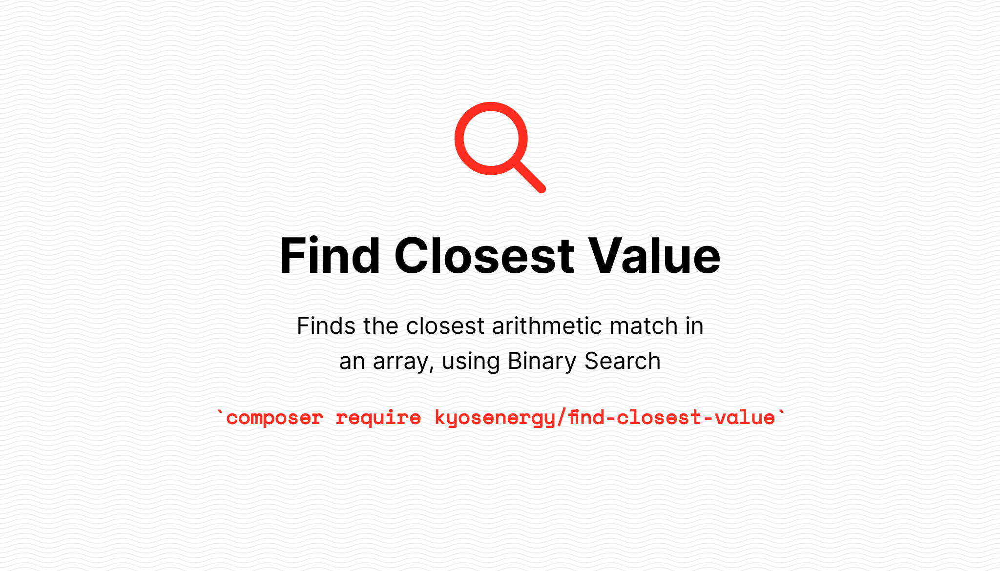

## FindClosestValue

[](https://packagist.org/packages/kyos/find-closest-value)
[](https://github.com/kyosenergy/find-closest-value/actions/workflows/run-tests.yml)
[](https://github.com/kyosenergy/find-closest-value/actions?query=workflow%3A"Check+%26+fix+styling"+branch%3Amaster)
[](https://packagist.org/packages/kyos/find-closest-value)

Finds the closest arithmetic match in an array, using Binary Search

## Installation

You can install the package via composer:

```bash
composer require kyos/find-closest-value
```

## Usage

```php
echo (new Kyos\FindClosestValue\FindClosestValue())->findClosest([2, 5, 9], 4); // 5
```

## Testing

```bash
composer test
```

## Changelog

Please see [CHANGELOG](CHANGELOG.md) for more information on what has changed recently.

## Contributing

Please see [CONTRIBUTING](.github/CONTRIBUTING.md) for details.

## Security Vulnerabilities

Please review [our security policy](../../security/policy) on how to report security vulnerabilities.

## Credits

- [Zois Pagoulatos](https://github.com/kyosenergy)
- [All Contributors](../../contributors)

## License

The MIT License (MIT). Please see [License File](LICENSE.md) for more information.
